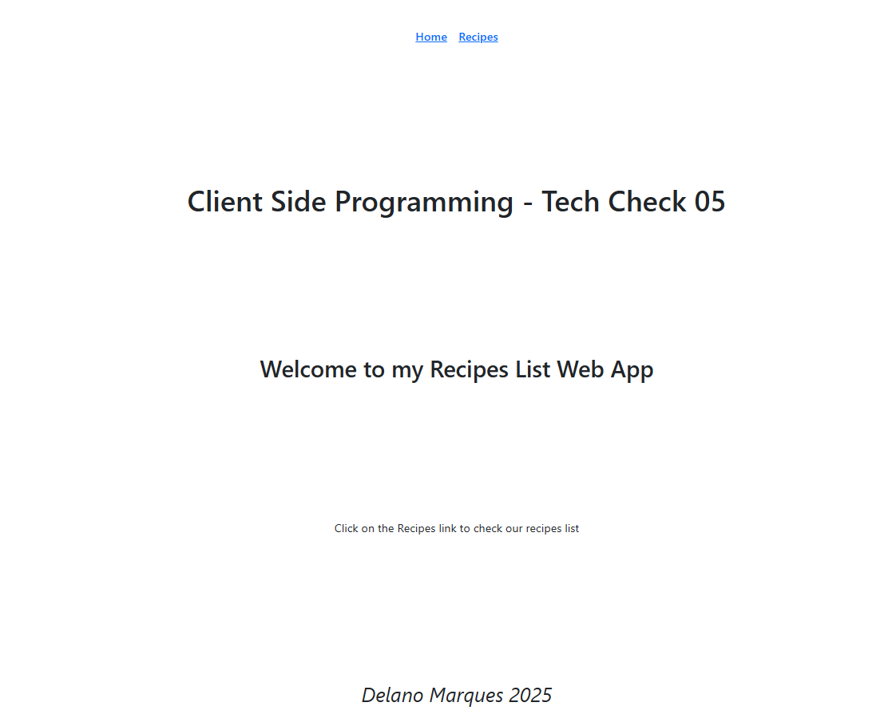
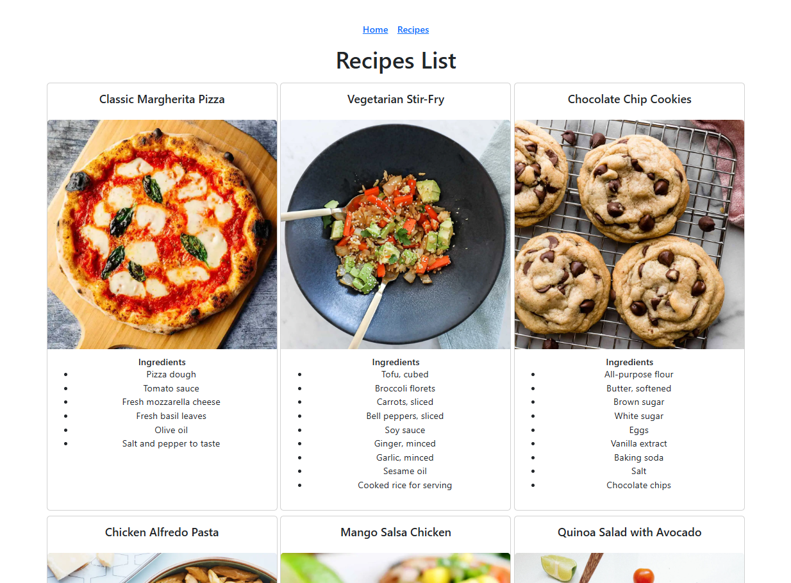

# Tech Check 5: React Hooks and React Router

This template provides a minimal setup to get React working in Vite with HMR and some ESLint rules.

## Setup
After cloning your repository, run:

- Use the following command to install all necessary npm packages (not included in the GitHub repository) for the React application as stored in the package.json file:
`npm install`
- Use the following command to start a local server:
`npm run dev`

## Objective
Create a simple React application that displays a list of recipes and their details. The application should have two main pages: a home page that provides info about the application and a recipes page listing all recipes (name, image, and ingredients). Use useState and useEffect to manage state and fetch data (using axios), React Router to handle navigation between pages, and react-bootstrap to style.

## Requirements
1. Header Component: display navigation Links (Home and Recipes)
2. Home Component: display information about the app
3. Recipes Component: display all recipes (name, image, and ingredients) in a card (use Bootstrap)
4. Footer Component: display your name 
5. You should make use of the provided src files (e.g. try to make use of the provided CSS, although you may need to modify the selectors based on the HTML structure your JSX creates). You will need to link your new Components in through App.js for the application to work.

### Important Notes
React Router, Axios, React Bootstrap dependencies are included in the project
There are no tests included with this Tech Check. Simply try to display a result similar to the following:

--------------------------

### Submission Instructions
Once your program is complete, or if you run out of in-class time to complete the Tech Check, commit and push your code to GitHub with the commit message "End of Class"
If you complete the Tech Check outside of class time, commit and push your subsequent code additions and changes with a message or "Ready for Marking"

### Marking Scheme
Final Grade | Requirement
:---: | ---
|**10/10** | Tech check is correct (matches desired output) and is completed within the allotted in-class time.
|**8/10** | Tech check is correct (matches desired output) and is completed within a 12-hour grace period beginning immediately following the end of in-class time.
|**6/10** | Tech check is correct (matches desired output) and is completed and submitted after the 12-hour grace period has elapsed.
|**0/10** | Tech check is not submitted or does not match desired output.
